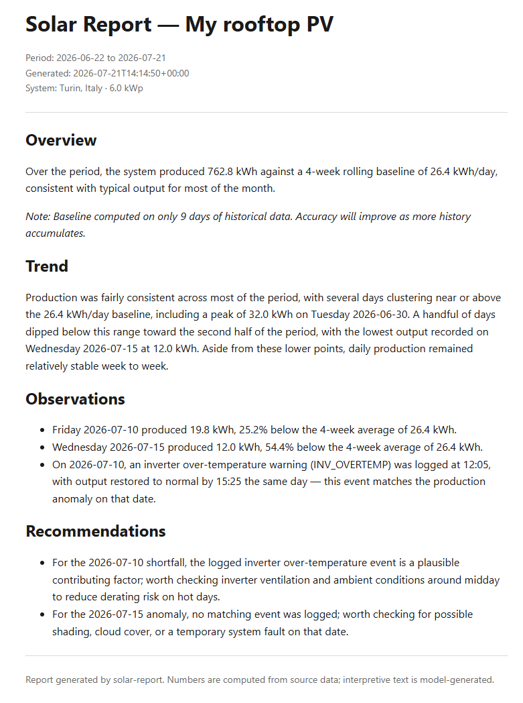

# solar-report

*A reporting layer for PV monitoring: structured production data in, grounded narrative reports out.*

[](https://opensource.org/licenses/Apache-2.0)



## Why

The LLM here never sees raw numbers to summarize on its own — it only narrates aggregations that are already computed in Python.

- **Strict grounding.** Aggregations, baseline, and anomaly detection are computed in Python before the LLM ever sees the data. The model narrates the figures it's given; it never calculates them independently, so it can't invent trends or comparisons that aren't backed by the source data.
- **A threshold born from iteration, not theory.** Anomalies are flagged only for negative deviations beyond 25% from a rolling baseline. An earlier 15% threshold flagged normal weather variability as anomalous — 25%, negative-only, reflects what the data actually looked like once tested against real production history.
- **Pluggable data sources.** The pipeline consumes a common production-data structure regardless of where it comes from. CSV is supported today; Home Assistant is next (v0.2), through the same aggregation and reporting pipeline.

## Sample report

```markdown
# Solar Report — My rooftop PV

**Period:** 2026-06-22 to 2026-07-21
**Generated:** 2026-07-21T07:31:45+00:00
**System:** Turin, Italy · 6.0 kWp

---

## Overview
Total production for the period reached 762.8 kWh, slightly below the expected output implied by the 26.4 kWh/day baseline (approximately 792 kWh over 30 days), a shortfall of roughly 4%.

_Note: Baseline computed on only 9 days of historical data. Accuracy will improve as more history accumulates._

## Trend
Output was fairly consistent through most of the period, with production regularly cycling between high days near 31-32 kWh and lower days in the low-20s kWh range, a pattern consistent with normal weekday/weekend or weather variation. The strongest day was Tuesday 2026-06-30 at 32.0 kWh, while the weakest was Wednesday 2026-07-15 at 12.0 kWh. Aside from the dip in mid-July, the rest of the month followed a steady rhythm without major swings.

## Observations
- Friday 2026-07-10 produced 19.8 kWh, 25.2% below the 4-week average of 26.4 kWh.
- Wednesday 2026-07-15 produced 12.0 kWh, 54.4% below the 4-week average of 26.4 kWh.
- An inverter overtemperature event was logged on 2026-07-10 at 12:05, with output restored to normal by 15:25 the same day, matching the production shortfall observed that day.

## Recommendations
- Worth checking inverter ventilation and mounting conditions, as the 2026-07-10 shortfall coincides with a logged overtemperature derating event; possible cause is restricted airflow or elevated ambient heat around midday.
- Consider reviewing weather records for 2026-07-15 to rule out cloud cover or shading as a contributing factor, since no corresponding event was logged for that day.

---

*Report generated by solar-report. Numbers are computed from source data; interpretive text is model-generated.*
```

## Quick start

```bash
git clone https://github.com/contimarco77/solar-report
cd solar-report && pip install -e .

# the config requires ANTHROPIC_API_KEY to be set to load — a placeholder is fine,
# dry-run skips the actual API call, so no real key or signup is needed yet
export ANTHROPIC_API_KEY=dry-run-placeholder
solar-report generate --config config.example.yaml --dry-run

# generate a real report (requires a real Anthropic API key — console.anthropic.com, paid account, no free tier)
export ANTHROPIC_API_KEY=sk-ant-...
solar-report generate --config config.yaml
```

> Running a weekly report is a single API call with a few thousand tokens — well under a cent even at non-discounted pricing. See [Anthropic's pricing page](https://claude.com/pricing) for current rates.

## Configuration

Config is a single YAML file, validated with pydantic — unknown keys are rejected, so a typo fails loudly instead of being silently ignored. Any string value can reference an environment variable with `${VAR_NAME}` syntax, resolved at load time. This is how the API key stays out of the config file itself.

### `system`

| Field | Type | Required | Notes |
|---|---|---|---|
| `name` | string | yes | Display name, shown in the report header |
| `location` | string | no | Free text, shown in the report header |
| `installed_kwp` | float (> 0) | yes | System size in kWp |
| `panels` | int (> 0) | no | Panel count |
| `tilt_deg` | float (0–90) | no | Panel tilt |
| `azimuth_deg` | float (0–360) | no | Panel azimuth |

### `source`

| Field | Notes |
|---|---|
| `kind` | `"csv"` or `"home_assistant"` — selects which section below is required |
| `csv.path` | Path to the production data CSV |
| `csv.events_path` | Optional path to an events/alarms CSV — see [Supported data sources](#supported-data-sources) |
| `csv.separator` | CSV field separator, default `,` — e.g. `;` for European exports |
| `csv.decimal` | Decimal point character, default `.` — e.g. `,` for European exports |
| `home_assistant.url` / `.token` / `.entity_id` | Schema already defined — see [Roadmap](#roadmap) for availability |

### `report`

| Field | Type | Default | Notes |
|---|---|---|---|
| `period` | `day` \| `week` \| `month` | `week` | `day` is accepted by the schema but not yet supported by the CLI, which currently rejects it |
| `tone` | `friendly` \| `technical` \| `brief` | `friendly` | Adjusts the language style of the generated report |
| `language` | `en` | `en` | Only value currently accepted — anomaly detection is i18n-ready internally, but the config schema doesn't expose other languages yet |
| `output_format` | `markdown` \| `html` | `markdown` | |
| `output_path` | template string | `./reports/{period}-{date}` | `{period}` and `{date}` are expanded at generation time; leave the extension out — it's appended automatically based on `output_format` |

### `llm`

| Field | Type | Default | Notes |
|---|---|---|---|
| `provider` | `"anthropic"` | `anthropic` | Only provider currently supported |
| `model` | string | `claude-sonnet-5` | Any Claude model string |
| `api_key` | string | — | Required; typically `${ANTHROPIC_API_KEY}` |
| `max_tokens` | int (> 0) | `1500` | |

## Supported data sources

| Source | Status | Notes |
|---|---|---|
| CSV (production) | Available | See [CSV format](#csv-format) below |
| CSV (events, optional) | Available | See [CSV format](#csv-format) below |
| Home Assistant | Planned — v0.2 | REST API + long-term statistics |
| Solar-Log | Planned — v0.2 | Local JSON API |

### CSV format

**Production** (`source.csv.path`)

| Column | Type | Notes |
|---|---|---|
| `timestamp` | ISO 8601, timezone-aware | Explicit offset required — e.g. `2026-07-14T12:00:00+02:00` or `...Z`. Naive timestamps are rejected. |
| `production_wh` | float (≥ 0) | Incremental energy for the interval, in Wh — not a cumulative meter reading |

Default separator is `,` and default decimal point is `.`. Both are configurable via `source.csv.separator` / `source.csv.decimal` for European-style exports (e.g. `;` separated, `,` decimal).

**Events** (`source.csv.events_path`, optional)

| Column | Type | Notes |
|---|---|---|
| `timestamp` | ISO 8601, timezone-aware | Same format as production |
| `severity` | string | e.g. `warning`, `info` |
| `code` | string | Vendor/device event code |
| `message` | string | Free-text description |

When present, events are correlated in the report against detected anomalies — see [Sample report](#sample-report) for an example. If the source is omitted, the tool behaves exactly as without an events feed.

## Roadmap

**Shipped — v0.1**
- Core pipeline: CSV source, aggregations, anomaly detection, LLM-generated reports (Markdown/HTML)
- Optional events/alarms via a secondary CSV, correlated with detected anomalies
- i18n-ready refactor — data and presentation separated, prompt language parametrized
- Docker packaging

**Planned — v0.2**
- Home Assistant data source (REST API + long-term statistics)
- Native events/alarms from Home Assistant and Solar-Log
- Full i18n (Italian, German, French)
- Solar-Log data source (local JSON API)
- Pluggable LLM providers — the `llm/client.py` abstraction already supports this; a local-model backend via Ollama is a natural next step for the Home Assistant / self-hosting community

## Known limitations

- **No retry/backoff beyond the Anthropic SDK defaults, no streaming.** Out of scope for v0.1 by design. If you're running this on a schedule (e.g. a weekly cron job), a transient API failure will fail that run rather than retry.

## License

Apache License 2.0 — see [LICENSE](LICENSE).

---

Marco Conti — software engineer, seven years in industrial software and OT/IT integration. Reach out: ing.marco.conti@proton.me
